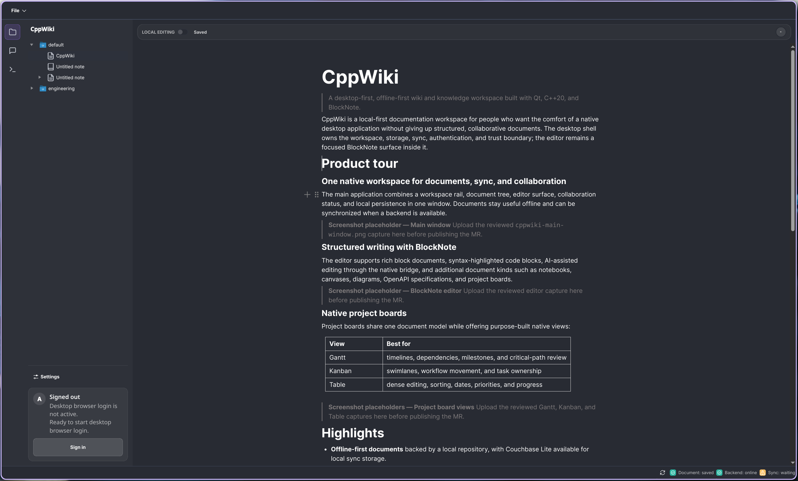
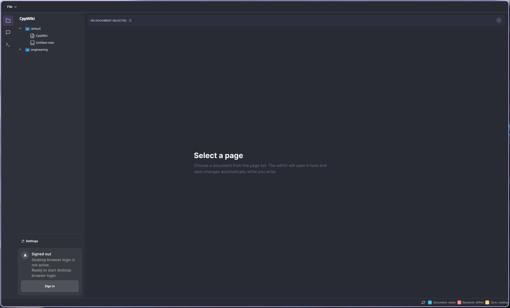
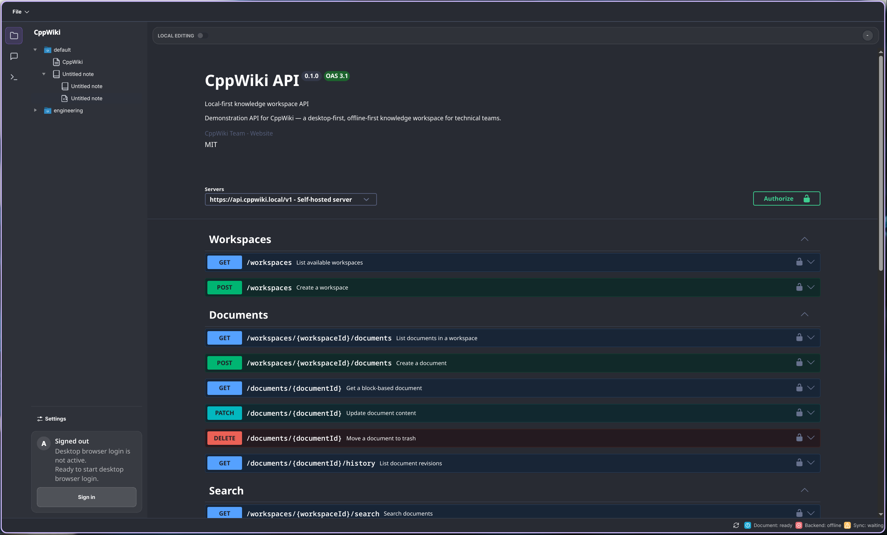
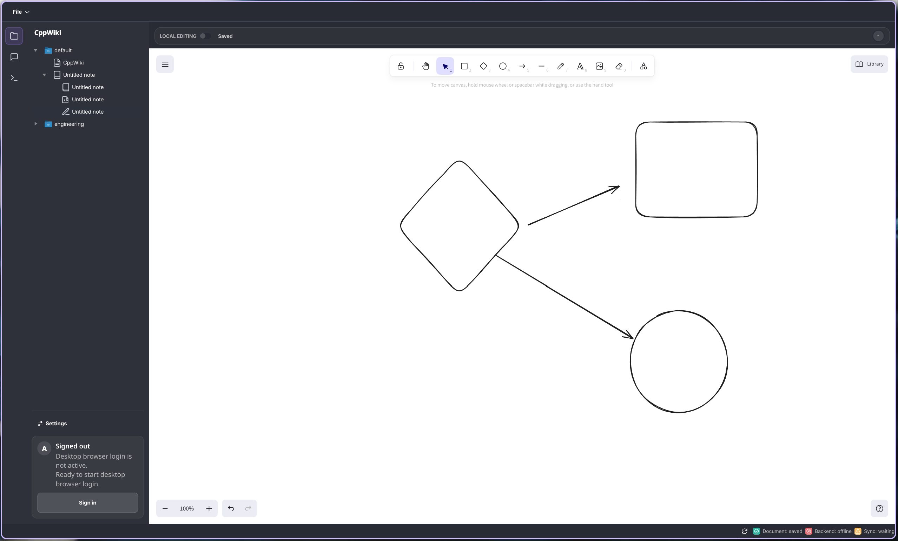
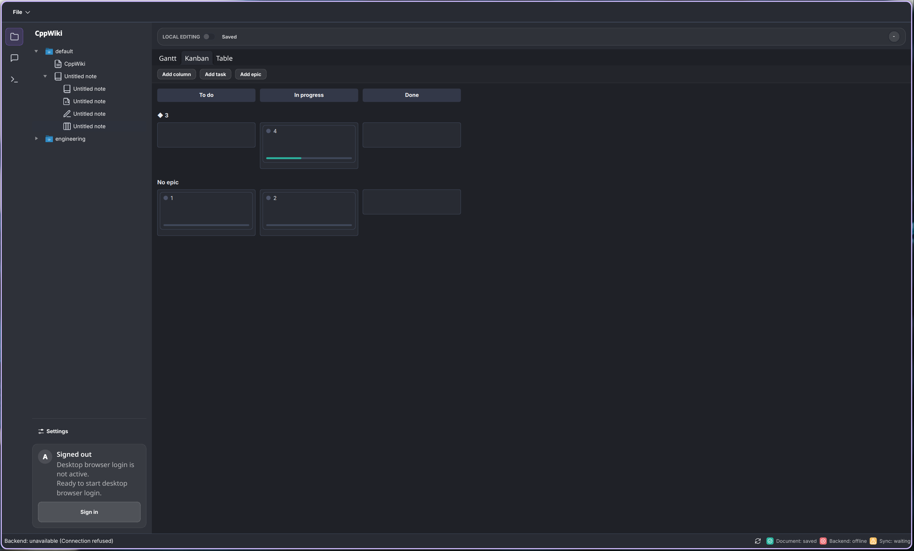
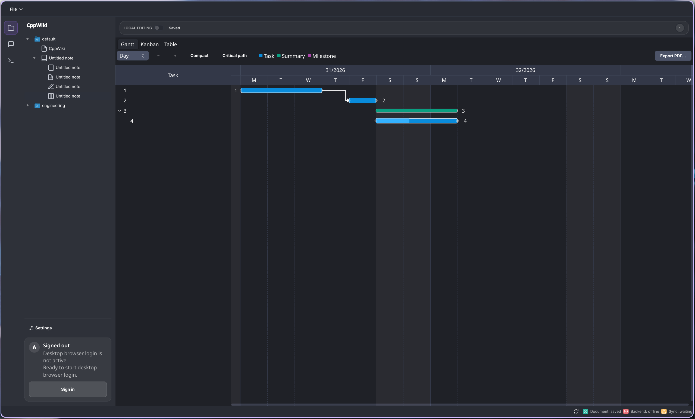
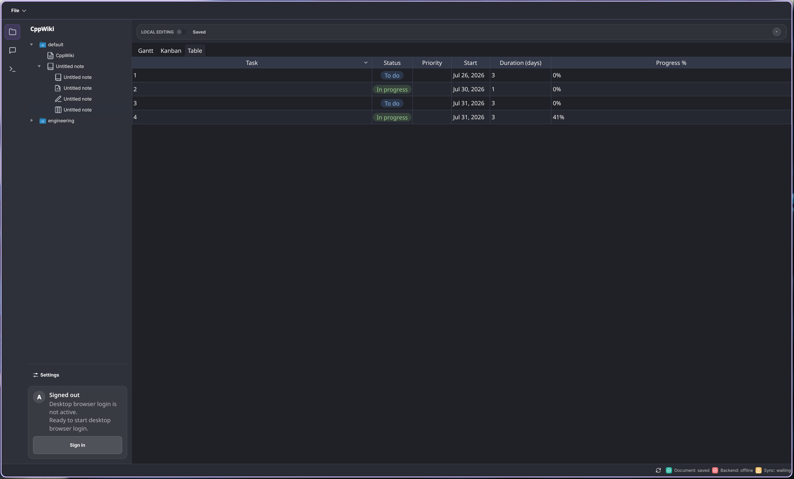
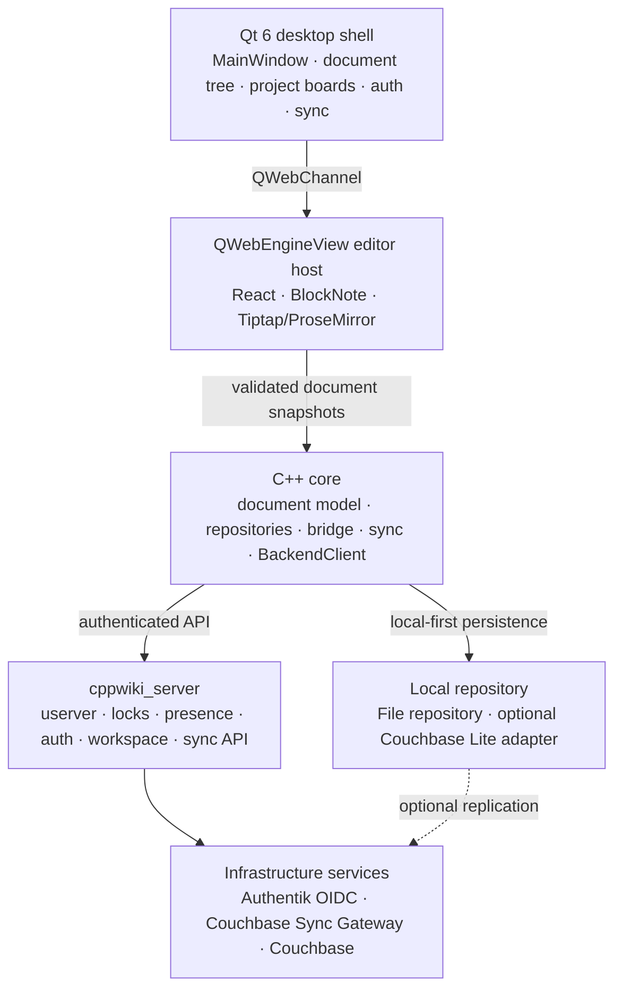

# CppWiki

  

  <strong>A desktop-first, offline-first wiki platform for structured knowledge.</strong>

CppWiki combines a native Qt desktop shell with a BlockNote editor, typed document
storage, authenticated collaboration services, and a C++ backend. It is designed
for teams that need a local, responsive knowledge base without giving up sync,
access control, or an extensible architecture.

> **Project status:** active development — Wiki Platform v9, Block Document Edition.
> APIs, storage adapters, and product workflows are still evolving.

  
  
  
  

## Product tour

  

CppWiki brings the workspace rail, document tree, editor surface, collaboration
status, and local persistence together in one native desktop window. Documents
remain useful offline and can be synchronized when a backend is available.

<table>
  <tr>
    <td width="50%" valign="top">
      
      
<strong>Local-first workspace</strong> Start with a local document tree and continue working without a backend session.

    </td>
    <td width="50%" valign="top">
      
      
<strong>Inspectable API surface</strong> Explore the authenticated backend through the built-in OpenAPI and Swagger UI surface.

    </td>
  </tr>
  <tr>
    <td colspan="2" valign="top">
      
      
<strong>Beyond plain pages</strong> Structured content can grow into canvases, diagrams, notebooks, and other document kinds.

    </td>
  </tr>
</table>

### Native project boards

Project boards share the document model while offering purpose-built views for
planning and delivery:

<table>
  <tr>
    <td width="33%" valign="top">
<strong>Kanban</strong> Workflow movement and ownership
</td>
    <td width="33%" valign="top">
<strong>Gantt</strong> Timelines, dependencies, and milestones
</td>
    <td width="33%" valign="top">
<strong>Table</strong> Dense editing, dates, and progress
</td>
  </tr>
</table>

CppWiki is built around a structured document model rather than a text file with
formatting layered on top. The desktop shell owns the workspace experience, while
BlockNote handles block editing inside a restricted QWebEngineView surface.

## Highlights

- **Native desktop experience** — Qt 6 and C++20 provide the application shell,
  navigation, settings, document tree, collaboration indicators, and native
  project-board widgets.
- **Structured documents** — BlockNote JSON is validated and persisted as the
  document source of truth. The model is prepared for additional content kinds,
  including notebooks and canvases.
- **Offline-first workflow** — local persistence and editing remain useful when
  the backend is unavailable; synchronization is an additional consistency layer,
  not a replacement for local work.
- **Explicit collaboration state** — the current model is single-writer,
  multi-reader. Lock ownership, presence, editability, and conflict state are
  separate concepts and are surfaced to the user.
- **Authenticated sync path** — Authentik OIDC with PKCE protects backend access;
  Couchbase Lite and Sync Gateway provide the planned replication path.
- **Secure editor boundary** — JavaScript communicates with the C++ core through a
  narrow QWebChannel bridge and does not receive raw filesystem access, tokens,
  database handles, or unrestricted network access.
- **Extensible foundation** — the architecture leaves room for sandboxed WASM
  plugins and future collaboration without making them prerequisites for the MVP.
- **Developer-friendly tooling** — CMake presets, vcpkg manifest mode, isolated
  test targets, an OpenAPI/Swagger surface, and an Antora documentation site are
  part of the repository.

## Architecture

The most important boundary is EditorBridge: the browser editor requests
document operations from C++, while storage, authentication, synchronization,
and local file access remain outside the web runtime.

## Repository layout

| Path | Responsibility |
| --- | --- |
| src/app/ | Application startup, settings, logging, and fallback UI |
| src/gui/ | Qt desktop shell, document navigation, settings, conflicts, and project boards |
| src/bridge/ | QWebChannel bridge between C++ and BlockNote |
| src/document/ | Document DTOs, BlockNote snapshots, and validation |
| src/storage/ | Local filesystem repository and optional Couchbase Lite adapter |
| src/sync/ | Push/pull synchronization and conflict detection |
| src/auth/ | OIDC session lifecycle and secure token storage |
| src/backend/ | Desktop HTTP client for cppwiki_server |
| src/server/ | userver backend, middleware, handlers, and services |
| frontend/editor/ | React/Vite/TypeScript BlockNote editor bundle |
| tests/ | Unit and component tests for desktop, storage, sync, and server code |
| doc/ | Antora documentation, ADRs, PRD, roadmap, and backlog |
| dev/ | Local Authentik, PostgreSQL, Redis, Couchbase, and Sync Gateway setup |
| packaging/ | Desktop packaging metadata for Linux and Windows |

## Requirements

- CMake 3.24 or newer
- Ninja
- A C++20 compiler
- Qt 6.5 or newer with Core, Gui, Widgets, NetworkAuth, WebChannel,
  WebEngineWidgets, Svg, Qml, Quick, and QuickWidgets
- vcpkg in manifest mode
- Node.js and npm for the editor bundle and documentation site
- Docker or another Compose-compatible runtime for the local backend stack

Qt is not installed by vcpkg. Install Qt separately and provide its prefix with
CMAKE_PREFIX_PATH when CMake cannot find it automatically.

## Build the desktop application

Initialize submodules, set up vcpkg, and configure the standard Debug preset:

~~~bash
git submodule update --init --recursive
export VCPKG_ROOT=/path/to/vcpkg

cmake --preset debug \
  -DCMAKE_PREFIX_PATH=/path/to/Qt/6.x.x/gcc_64
cmake --build --preset debug
~~~

The desktop executable is cppwiki_app. The default build also includes the test
suite and project-board targets. For a release build:

~~~bash
cmake --preset release \
  -DCMAKE_PREFIX_PATH=/path/to/Qt/6.x.x/gcc_64
cmake --build --preset release
~~~

Useful CMake options:

| Option | Default | Purpose |
| --- | ---: | --- |
| CPPWIKI_BUILD_DESKTOP_APP | ON | Build the Qt desktop application |
| CPPWIKI_BUILD_SERVER | ON | Build cppwiki_server |
| CPPWIKI_BUILD_TESTS | ON | Build and register CTest targets |
| CPPWIKI_BUILD_ADMIN_CLI | ON | Build the cppwiki-admin CLI |
| CPPWIKI_ENABLE_CBLITE_STORAGE | OFF | Enable the Couchbase Lite repository adapter |
| CPPWIKI_BUILD_EDITOR_BUNDLE_WITH_APP | OFF | Build the frontend bundle as part of the app build |
| CPPWIKI_ENABLE_CLANG_TIDY | OFF | Enable clang-tidy when available |

For a server-only build, use the preset that does not require Qt:

~~~bash
cmake --preset server-debug
cmake --build --preset server-debug
~~~

## Build the editor bundle

The embedded editor is developed independently as a Vite + React + TypeScript
application:

~~~bash
cd frontend/editor
npm ci
npm run build
~~~

The generated bundle is written to frontend/editor/dist. The desktop app loads
dist/index.html; when it is absent, it shows a diagnostic fallback page. To
build the bundle automatically from CMake:

~~~bash
cmake --preset debug \
  -DCMAKE_PREFIX_PATH=/path/to/Qt/6.x.x/gcc_64 \
  -DCPPWIKI_BUILD_EDITOR_BUNDLE_WITH_APP=ON
cmake --build --preset debug
~~~

For local frontend development:

~~~bash
cd frontend/editor
npm run dev
~~~

## Run tests

Tests are registered with CTest and can be run as a complete suite or by target
name:

~~~bash
cmake --build --preset debug
ctest --test-dir build/debug --output-on-failure
ctest --test-dir build/debug -R cppwiki_document_validator_tests --output-on-failure
~~~

Frontend tests use Vitest:

~~~bash
cd frontend/editor
npm test
~~~

## Local services

dev/docker-compose.yml provides the services needed for local authentication and
sync experiments:

- Authentik — OIDC identity provider;
- PostgreSQL and Redis — Authentik dependencies;
- Couchbase Server — document database;
- Couchbase Sync Gateway — replication and sync API.

Create a local .env from the values expected by the Compose file, then start the
stack:

~~~bash
cd dev
docker compose up -d
~~~

The backend reads runtime settings from config/server.yaml; a container-oriented
variant is available at config/server.docker.yaml. The sync gateway bootstrap and
database configuration live under dev/sync-gateway/.

Do not commit local secrets, OIDC credentials, database passwords, or generated
service data.

## Documentation

The repository documentation is an Antora site sourced from doc/:

~~~bash
npx antora generate antora-playbook.yml
npx http-server build/site
~~~

Start with:

- [Documentation overview](doc/modules/ROOT/pages/index.adoc)
- [PRD v9 — Block Document Edition](doc/modules/ROOT/pages/PRD_v9_Block_Document_Edition.adoc)
- [Architecture baseline](doc/modules/ROOT/pages/architecture/Architecture_Baseline_Libraries_and_Approaches.adoc)
- [Desktop/backend/sync interaction](doc/modules/ROOT/pages/architecture/Desktop_Backend_Sync_Interaction.adoc)
- [Server and realtime editing architecture](doc/modules/ROOT/pages/architecture/Server_and_Realtime_Editing_Architecture.adoc)
- [QWebChannel editor bridge](doc/modules/ROOT/pages/architecture/QWebChannel_Editor_Bridge_Explained.adoc)
- [Current roadmap](doc/modules/ROOT/pages/roadmap/Current_Roadmap.adoc)
- [Context glossary](doc/modules/ROOT/pages/CONTEXT.adoc)

Architecture decisions are recorded in [doc/modules/ROOT/pages/architecture/adr/](doc/modules/ROOT/pages/architecture/adr/).

## Scope and roadmap

The current MVP deliberately prioritizes a reliable desktop and local document
workflow. It does not promise full Google Docs-style multi-writer collaboration,
complete Confluence macro parity, mobile clients, or server-side AI automation.

The longer-term direction includes richer synchronization, realtime collaboration,
Confluence interoperability, sandboxed WASM extensions, additional document kinds,
and carefully scoped AI capabilities. See the [current roadmap](doc/modules/ROOT/pages/roadmap/Current_Roadmap.adoc)
and [backlog](doc/modules/ROOT/pages/backlog/Backlog.adoc) for the project view of
planned work.

## Contributing

Before making a non-trivial change, read the relevant architecture document or ADR
and check the current backlog. Keep the boundaries between the Qt shell, embedded
editor, C++ core, backend, and sync layer explicit. New behavior should include
focused tests where practical and should preserve the offline-first path.

For code style and repository workflow, see [CLAUDE.md](CLAUDE.md) and
[Project Structure and Style](doc/modules/ROOT/pages/architecture/Project_Structure_and_Style.adoc).

## License

CppWiki is distributed under the [GNU Affero General Public License v3.0](LICENSE).
