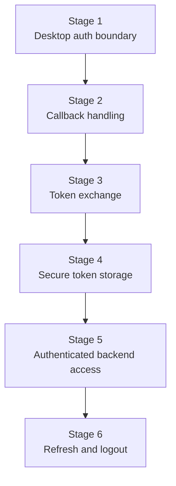
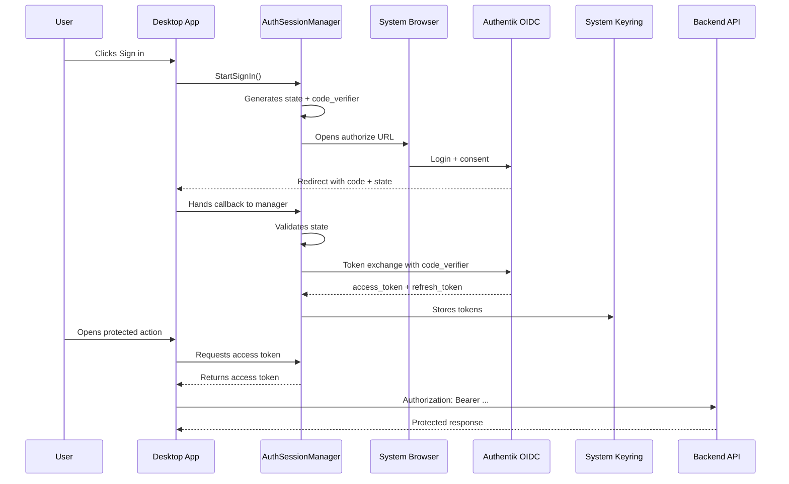

# Desktop Auth Flow

## Purpose

This document defines the target desktop authentication model for CppWiki.

It is self-contained and describes:

- the goal of the auth phase;
- the staged implementation plan;
- what should appear in user settings;
- how tokens should be stored;
- the full desktop OIDC/PKCE flow;
- responsibility boundaries between the desktop shell, backend, and editor runtime.

---

## 1. Goal of the auth phase

Desktop authentication in CppWiki must:

- start login through the system browser;
- use OIDC Authorization Code Flow with PKCE;
- keep tokens out of the web editor;
- store secrets in the system keyring;
- send bearer tokens only from the desktop shell to protected backend endpoints;
- support refresh and logout without mixing auth lifecycle into editor logic.

The auth phase should not immediately include sync, channel mapping, or a full permissions UI.  
Its main objective is to establish a reliable authentication boundary between the desktop shell, the identity provider, and the backend.

---

## 2. Implementation plan

### Stage 1. Desktop auth boundary

This stage introduces:

- auth settings;
- `AuthSessionManager`;
- desktop auth UI states;
- system-browser launch for the authorize URL;
- PKCE lifecycle (`code_verifier`, `code_challenge`, `state`).

Result:

- auth lives in the C++ desktop shell;
- the editor runtime does not participate in auth;
- the application is prepared for callback handling and token exchange.

### Stage 2. Callback handling

Add one callback strategy:

- `localhost` callback;
- custom URI scheme, for example `cppwiki://auth/callback`.

Result:

- the desktop app receives the authorization `code`;
- the desktop app validates `state`;
- callback data is handed back to `AuthSessionManager`.

### Stage 3. Token exchange

The desktop app exchanges the authorization code for:

- `access_token`;
- `refresh_token`;
- optionally `id_token`;
- `expires_in`.

Result:

- real authenticated session state becomes available;
- the desktop app can begin making authenticated backend requests.

### Stage 4. Secure token storage

Tokens are stored in the system keyring.

Result:

- secrets do not go into `QSettings`;
- secrets do not go into local plain-text files;
- secrets do not go into the editor runtime.

### Stage 5. Authenticated backend access

The desktop client starts sending `Authorization: Bearer <token>` to protected backend endpoints.

Result:

- public endpoints remain available without a token;
- protected endpoints begin depending on real desktop auth state.

### Stage 6. Refresh and logout

Add:

- refresh via `refresh_token`;
- local sign-out;
- keyring cleanup;
- correct handling of expired or invalid tokens.

Result:

- the desktop session becomes operational for normal use;
- a full login is only needed when auth state is genuinely lost.

---

## 3. What belongs in settings

Desktop settings should contain only auth provider configuration and desktop auth wiring.

Reasonable minimum:

- `auth_enabled`
- `authorization_url`
- `client_id`
- `redirect_uri`

If OIDC discovery is added later, some of these settings may be replaced by:

- `issuer`
- or a `well-known` endpoint.

### What should not be user-facing settings

The following values must not be exposed as editable settings:

- `access_token`
- `refresh_token`
- `id_token`
- `code_verifier`
- `state`
- keyring service or account names
- token expiration timestamps

These values belong to runtime auth session handling and internal implementation, not to user configuration.

---

## 4. What should be stored in keyring

The keyring should store secrets and only the minimum required auth session secrets.

Usually that means:

- `access_token`
- `refresh_token`
- optionally `id_token`

Optionally it may also store:

- `token_type`
- `expires_at`

If lifecycle handling does not require those fields, they can remain in memory.

### What may live outside the keyring

Regular desktop settings may store:

- `authorization_url`
- `client_id`
- `redirect_uri`
- `auth_enabled`

These are not secrets.  
They configure the auth provider rather than protect the live session.

---

## 5. Full desktop auth flow

### 5.1. Application startup

The desktop application creates:

- `AuthSessionManager`
- `BackendClient`
- `AppContext`

`AuthSessionManager` reads settings and determines one of the initial states:

- auth is disabled;
- auth is enabled but not configured;
- auth is enabled and ready for login.

### 5.2. Login start

When the user clicks `Sign in`:

1. `code_verifier` is generated;
2. `state` is generated;
3. `code_challenge` is computed using PKCE (`S256`);
4. the authorize URL is assembled;
5. the system browser is opened.

A standard authorize URL contains:

- `response_type=code`
- `client_id`
- `redirect_uri`
- `scope`
- `state`
- `code_challenge`
- `code_challenge_method=S256`

### 5.3. Browser login

The user completes login in the system browser.

This means:

- the application does not embed a username/password form;
- the application never receives the password directly;
- the auth path remains a standard OIDC browser flow.

### 5.4. Callback

After a successful login, the provider redirects to:

- `cppwiki://auth/callback?...`
  or
- `http://127.0.0.1:<port>/callback?...`

The desktop app must:

- receive `code`;
- receive `state`;
- compare `state` to the previously generated value;
- reject the callback if the values do not match.

### 5.5. Token exchange

After callback, the desktop app calls the token endpoint with:

- `grant_type=authorization_code`
- `code=<authorization_code>`
- `redirect_uri=<redirect_uri>`
- `client_id=<client_id>`
- `code_verifier=<original verifier>`

The response contains tokens.

At this step `AuthSessionManager`:

- stores tokens in keyring;
- clears temporary PKCE state;
- transitions the session into authenticated state.

### 5.6. Authenticated backend calls

When the desktop shell calls protected backend endpoints:

- it loads `access_token` from the auth session;
- adds `Authorization: Bearer ...`;
- handles `401/403`.

The web editor does not:

- receive tokens;
- receive refresh tokens;
- access the keyring;
- control auth lifecycle.

### 5.7. Refresh

When `access_token` is expired or near expiration:

- the desktop app refreshes via `refresh_token`;
- stores updated tokens;
- continues without requiring a new login.

If refresh fails:

- the session moves to `signed out` or `error`;
- the UI reports that login is required again.

### 5.8. Logout

Logout must:

- clear keyring;
- reset in-memory auth state;
- stop sending bearer tokens;
- move the UI into `signed out`.

---

## 6. Relationship to the backend

The health endpoint should remain public.

This allows the desktop app to:

- verify backend availability without a token;
- separate connectivity state from auth state.

Protected endpoints should follow this rule:

- no token: `401/403`;
- invalid token: `401/403`;
- valid token: access is controlled by backend auth middleware.

Correct implementation order:

1. desktop login path;
2. backend JWT validation;
3. real protected desktop actions.

---

## 7. Responsibility boundaries

### `AuthSessionManager`

Should own:

- auth session state;
- PKCE lifecycle;
- callback validation;
- token exchange;
- keyring storage;
- refresh;
- logout.

### `BackendClient`

Should own:

- HTTP interaction with the backend;
- public and protected request execution;
- bearer token usage when an authenticated session exists.

### Desktop UI

Should own:

- auth state presentation;
- `Sign in` / `Sign out` actions;
- user-visible auth errors and status messages.

### Web editor

Must not own:

- token storage;
- login flow;
- refresh flow;
- direct backend authentication;
- keyring access.

---

## 8. Current implementation state

The current code already contains:

- auth settings in the desktop shell;
- a dedicated `AuthSessionManager`;
- an auth/profile card in the sidebar;
- system-browser login;
- localhost callback receiver;
- token endpoint exchange;
- keyring integration;
- authenticated backend calls;
- refresh flow;
- logout flow;
- backend JWT validation for protected routes;
- runtime token-expiry handling without application restart.

The current implementation is sufficient to consider Phase 6 complete on the development setup. It is still not the final long-term auth subsystem, but it is no longer only a skeleton.

---

## 9. Next practical step

After this stage, the next reasonable order is:

1. use authenticated identity in collaboration flows such as lock ownership and presence;
2. make backend lock ownership authoritative for editor write access;
3. enforce read-only fallback in the desktop editor when another user owns the lock;
4. then move on to authenticated replication and sync behavior.

---

## 10. Conclusion

Desktop auth for CppWiki should be implemented as a dedicated C++ shell layer with a strict authentication boundary.

Key rules:

- settings configure the provider but do not store secrets;
- keyring stores tokens but is not a user-configurable UI surface;
- `AuthSessionManager` owns the auth lifecycle;
- the editor runtime never receives tokens;
- the auth phase must first establish the correct architecture, then complete the full OIDC flow.
