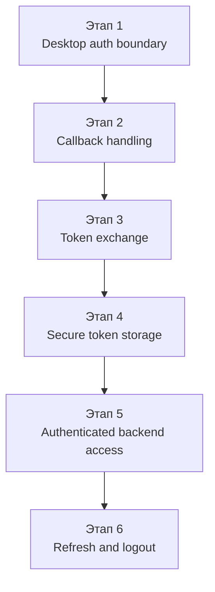
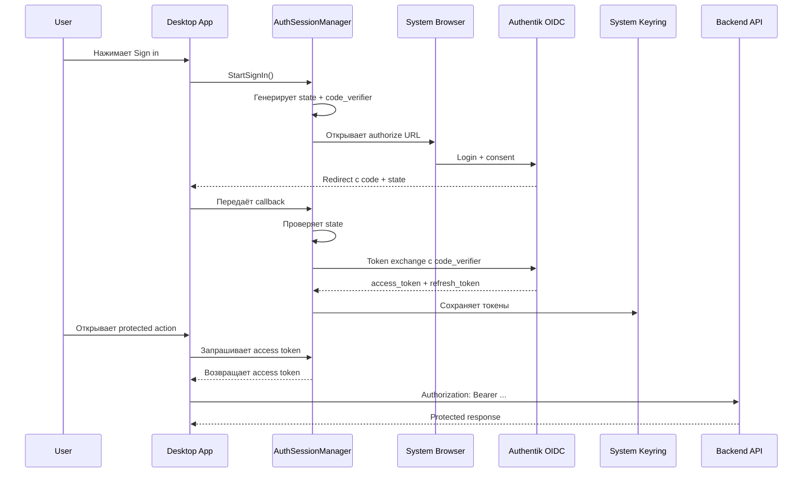

# Desktop Auth Flow (RU)

## Назначение

Этот документ фиксирует целевую модель desktop-аутентификации для CppWiki.

Документ самодостаточен и описывает:

- цель auth-фазы;
- поэтапный план внедрения;
- состав пользовательских настроек;
- правила хранения токенов;
- полный desktop OIDC/PKCE flow;
- границы ответственности между desktop shell, backend и editor runtime.

---

## 1. Цель auth-фазы

Desktop auth в CppWiki должен решать следующие задачи:

- запускать login через system browser;
- использовать OIDC Authorization Code Flow with PKCE;
- не передавать токены в web editor;
- хранить секреты в системном keyring;
- отправлять bearer token только из desktop shell в protected backend endpoints;
- поддерживать refresh и logout без смешивания auth с editor logic.

Auth-фаза не должна сразу включать sync, channel mapping или полный permission UI.  
Её задача — построить надёжную authentication boundary между desktop shell, identity provider и backend.

---

## 2. План внедрения

### Этап 1. Desktop auth boundary

На этом этапе в desktop shell появляются:

- auth settings;
- `AuthSessionManager`;
- UI-состояния auth session;
- запуск system browser для authorize URL;
- PKCE lifecycle (`code_verifier`, `code_challenge`, `state`).

Результат этапа:

- auth живёт в C++ desktop слое;
- editor runtime не участвует в auth flow;
- приложение готово к дальнейшему callback и token exchange.

### Этап 2. Callback handling

Нужно добавить один из callback-механизмов:

- `localhost` callback;
- custom URI scheme, например `cppwiki://auth/callback`.

Результат этапа:

- desktop app принимает authorization `code`;
- desktop app валидирует `state`;
- callback передаётся в `AuthSessionManager`.

### Этап 3. Token exchange

Desktop app обменивает `authorization_code` на:

- `access_token`;
- `refresh_token`;
- при необходимости `id_token`;
- `expires_in`.

Результат этапа:

- появляется реальное состояние authenticated session;
- desktop app может начать делать authenticated backend calls.

### Этап 4. Secure token storage

Токены сохраняются в системный keyring.

Результат этапа:

- секреты не попадают в `QSettings`;
- секреты не попадают в локальные plain-text файлы;
- секреты не попадают в editor runtime.

### Этап 5. Authenticated backend access

Desktop client начинает отправлять `Authorization: Bearer <token>` в protected backend endpoints.

Результат этапа:

- public endpoints остаются доступными без токена;
- protected endpoints начинают опираться на реальный desktop auth state.

### Этап 6. Refresh and logout

Нужно добавить:

- refresh по `refresh_token`;
- local logout;
- очистку keyring;
- корректную обработку expired/invalid tokens.

Результат этапа:

- desktop session становится жизнеспособной в обычной работе;
- повторный login нужен только при реальной потере auth state.

---

## 3. Что должно быть в settings

Desktop settings должны содержать только конфигурацию auth provider и desktop auth wiring.

Разумный минимальный набор:

- `auth_enabled`
- `authorization_url`
- `client_id`
- `redirect_uri`

Если позже будет добавлен OIDC discovery, часть этих настроек может быть заменена на:

- `issuer`
- или `well-known` endpoint.

### Что не должно быть пользовательскими настройками

Следующие значения не должны быть editable settings:

- `access_token`
- `refresh_token`
- `id_token`
- `code_verifier`
- `state`
- keyring service/account names
- token expiration timestamps

Эти данные относятся к runtime auth session и внутренней реализации, а не к пользовательскому конфигу.

---

## 4. Что должно храниться в keyring

Keyring должен хранить только секреты и минимально необходимый auth session state.

Обычно это:

- `access_token`
- `refresh_token`
- при необходимости `id_token`

Опционально можно хранить:

- `token_type`
- `expires_at`

Если это не требуется для lifecycle, эти поля можно держать в памяти.

### Что допустимо хранить вне keyring

В обычных desktop settings могут жить:

- `authorization_url`
- `client_id`
- `redirect_uri`
- `auth_enabled`

Это не секреты.  
Они нужны для конфигурации auth provider, а не для защиты runtime session.

---

## 5. Полный desktop auth flow

### 5.1. Старт приложения

Desktop application создаёт:

- `AuthSessionManager`
- `BackendClient`
- `AppContext`

`AuthSessionManager` читает settings и определяет одно из стартовых состояний:

- auth выключен;
- auth включён, но ещё не настроен;
- auth включён и готов к login flow.

### 5.2. Запуск login

При нажатии `Sign in`:

1. генерируется `code_verifier`;
2. генерируется `state`;
3. считается `code_challenge` по PKCE (`S256`);
4. собирается authorize URL;
5. system browser открывает Authentik login flow.

Стандартный authorize URL содержит:

- `response_type=code`
- `client_id`
- `redirect_uri`
- `scope`
- `state`
- `code_challenge`
- `code_challenge_method=S256`

### 5.3. Browser login

Пользователь проходит login в system browser.

Это означает:

- приложение не показывает встроенную credential form;
- приложение не получает пароль напрямую;
- auth flow остаётся стандартным OIDC browser flow.

### 5.4. Callback

После успешного login provider делает redirect на:

- `cppwiki://auth/callback?...`
  или
- `http://127.0.0.1:<port>/callback?...`

Desktop app должен:

- получить `code`;
- получить `state`;
- сравнить `state` с ранее сгенерированным значением;
- отклонить callback при несовпадении.

### 5.5. Token exchange

После callback desktop app вызывает token endpoint с параметрами:

- `grant_type=authorization_code`
- `code=<authorization_code>`
- `redirect_uri=<redirect_uri>`
- `client_id=<client_id>`
- `code_verifier=<original verifier>`

В ответ приходят токены.

На этом шаге `AuthSessionManager`:

- сохраняет токены в keyring;
- очищает временные PKCE state данные;
- переводит session в authenticated state.

### 5.6. Authenticated backend calls

При обращении к protected backend endpoints desktop shell:

- извлекает `access_token` из auth session;
- добавляет `Authorization: Bearer ...`;
- обрабатывает `401/403`.

Web editor при этом:

- не получает токены;
- не получает refresh token;
- не получает доступ к keyring;
- не управляет auth lifecycle.

### 5.7. Refresh

Когда `access_token` истёк или близок к истечению:

- desktop app делает refresh через `refresh_token`;
- сохраняет новые токены;
- продолжает работу без повторного login.

Если refresh не удался:

- session переводится в `signed out` или `error`;
- UI сообщает, что нужен повторный login.

### 5.8. Logout

Logout обязан:

- очистить keyring;
- сбросить in-memory auth state;
- перестать отправлять bearer token;
- перевести UI в `signed out`.

---

## 6. Связь с backend

Health endpoint должен оставаться public.

Это позволяет desktop app:

- проверять доступность backend без токена;
- разделять connectivity state и auth state.

Protected endpoints должны работать по следующему правилу:

- без токена: `401/403`;
- с невалидным токеном: `401/403`;
- с валидным токеном: доступ определяется backend auth middleware.

Правильный порядок внедрения:

1. desktop login path;
2. backend JWT validation;
3. реальные protected desktop actions.

---

## 7. Границы ответственности

### `AuthSessionManager`

Должен отвечать за:

- auth session state;
- PKCE lifecycle;
- callback validation;
- token exchange;
- keyring storage;
- refresh;
- logout.

### `BackendClient`

Должен отвечать за:

- HTTP interaction с backend;
- public/protected request execution;
- bearer token usage при наличии authenticated session.

### Desktop UI

Должен отвечать за:

- отображение auth state;
- запуск `Sign in` / `Sign out`;
- отображение ошибок и статусов.

### Web editor

Не должен отвечать за:

- token storage;
- login;
- refresh;
- direct backend authentication;
- keyring access.

---

## 8. Текущее состояние реализации

На текущем этапе уже подготовлены:

- auth settings в desktop shell;
- отдельный `AuthSessionManager`;
- UI-карточка auth/profile в sidebar;
- запуск system browser login;
- localhost callback receiver;
- token endpoint exchange;
- keyring integration;
- authenticated backend calls;
- refresh flow;
- logout flow;
- backend JWT validation для protected routes;
- runtime token-expiry handling без перезапуска приложения.

Текущая реализация уже достаточна, чтобы считать `Phase 6` закрытой на dev-стенде. Это ещё не окончательная долгосрочная authentication subsystem, но это уже не просто skeleton.

---

## 9. Следующий практический шаг

После этого этапа следующий разумный порядок такой:

1. использовать authenticated identity в collaboration flows вроде lock ownership и presence;
2. сделать backend lock ownership авторитативным для write-доступа редактора;
3. ввести read-only fallback в desktop editor, если lock принадлежит другому пользователю;
4. только после этого переходить к authenticated replication и sync behavior.

---

## 10. Вывод

Desktop auth для CppWiki должен строиться как отдельный C++ shell layer с чёткой auth boundary.

Ключевые правила:

- settings конфигурируют provider, а не хранят секреты;
- keyring хранит токены, но не становится пользовательской настройкой;
- `AuthSessionManager` владеет auth lifecycle;
- editor runtime не получает токены;
- auth phase должна сначала построить правильную архитектурную границу, а затем уже завершать полный OIDC flow.
