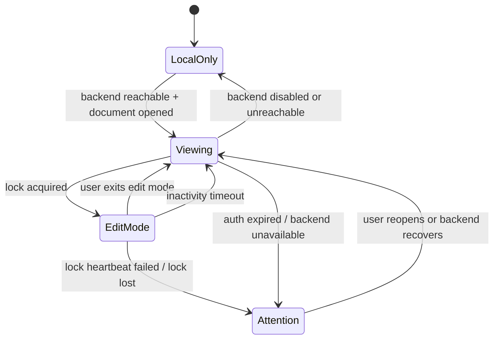
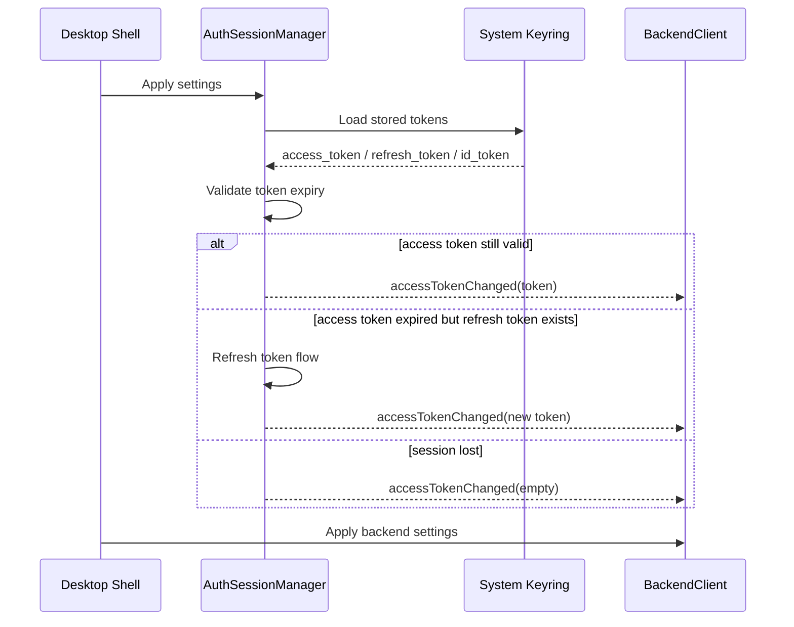
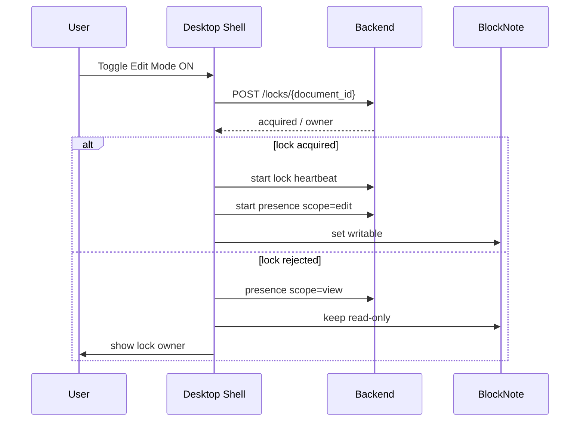
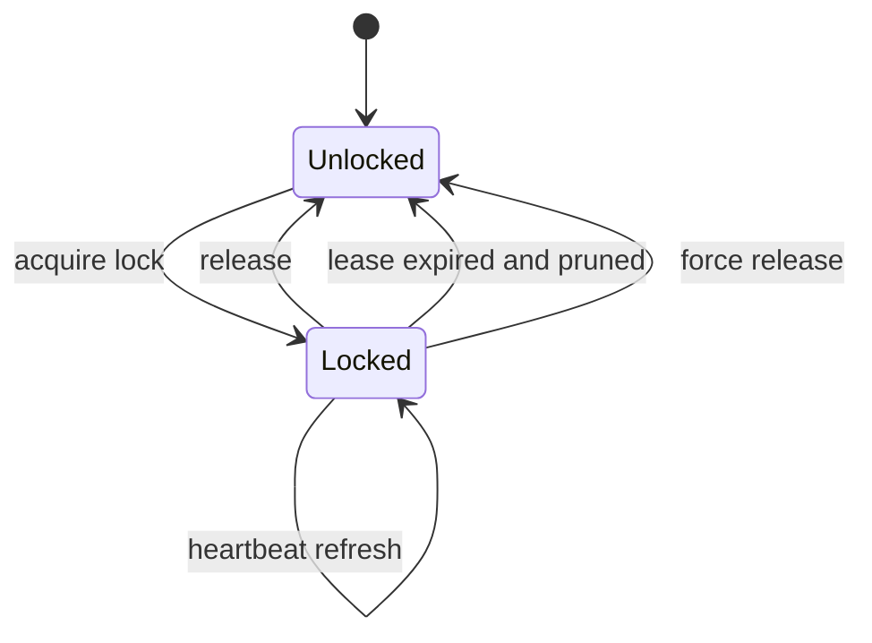
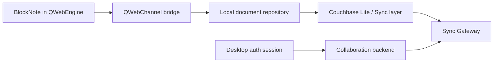
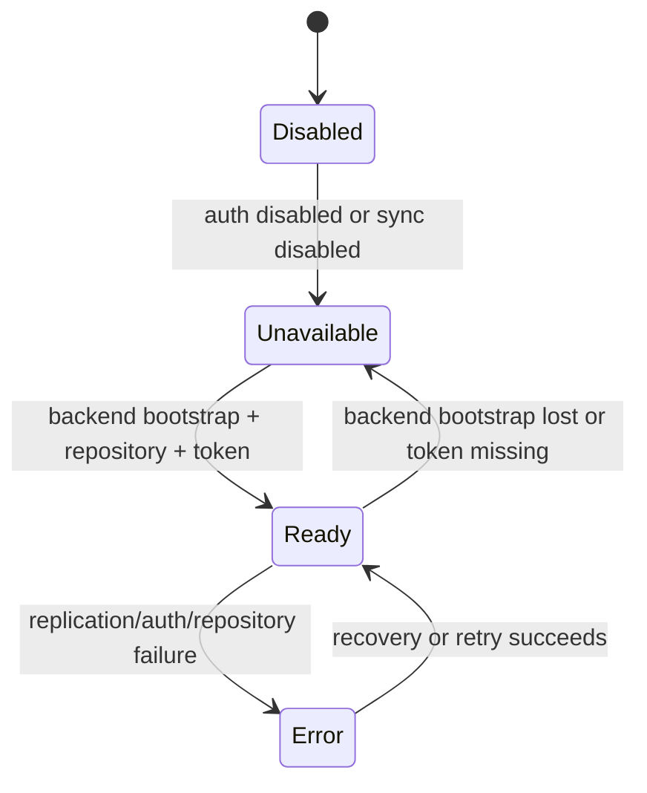
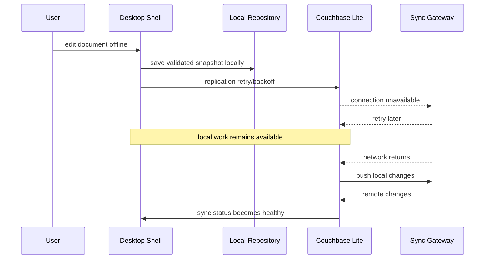
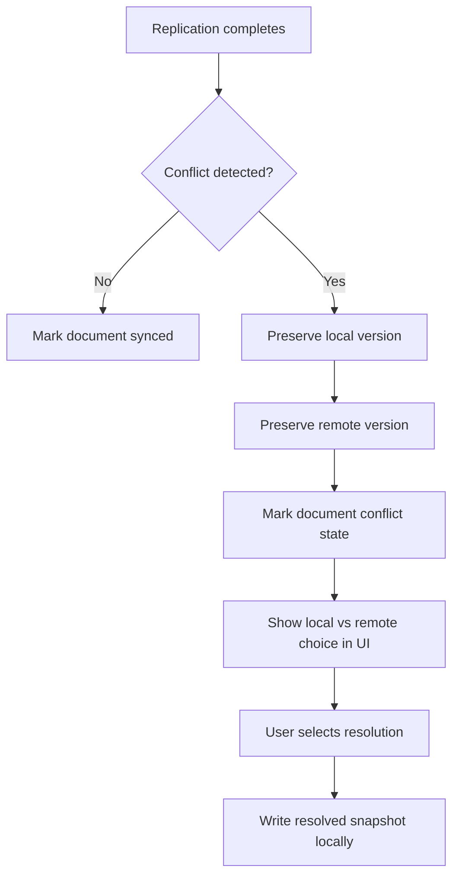

# Desktop, Backend and Sync Interaction

**Product:** CppWiki / Wiki Platform v9 - Block Document Edition  
**Status:** Draft / implementation-aligned after desktop collaboration and sync diagram spike  
**Date:** 2026-06-30  
**Related docs:** `doc/architecture/Desktop_Auth_Flow.md`, `doc/architecture/Server_and_Realtime_Editing_Architecture.md`, `doc/architecture/Sync_Document_Model_and_Conflict_Contract.md`, `doc/architecture/adr/ADR-003-collaboration-strategy.md`, `doc/architecture/adr/ADR-008-authentik-auth-model.md`, `doc/roadmap/Current_Roadmap.md`

---

# 1. Purpose

This document defines how the desktop shell, backend collaboration APIs and future Couchbase sync are expected to work together.

It is self-contained and describes:

- what already exists in the desktop app and server;
- which side owns auth, locks, presence and persistence;
- how document access changes between viewing and editing;
- what should happen when auth expires or lock ownership is lost;
- how the future sync layer should fit into the current architecture without rewriting the desktop collaboration model.

The main goal is to prevent sync work from introducing ambiguity into the already implemented desktop auth and collaboration flow.

---

# 2. Core Principle

CppWiki currently follows this model:

- the desktop app owns the local document repository and editor runtime;
- the backend owns authenticated coordination;
- coordination means lock ownership, presence visibility and future workspace-scoped policy;
- sync must move document data between local storage and the remote system, but it must not replace the lock/presence model.

In practical terms:

- local save/load remains possible even when the backend is unavailable;
- authenticated collaboration features only exist when the backend is reachable;
- sync is an additional transport and consistency layer, not a second editor and not a replacement for document access coordination.

---

# 3. Responsibility Split

## 3.1. Desktop shell

The desktop shell is responsible for:

- launching OIDC login in the system browser;
- storing tokens in the system keyring;
- keeping tokens out of the editor runtime;
- hosting BlockNote in `QWebEngineView`;
- maintaining the local document repository;
- switching between view mode and edit mode;
- autosaving validated document snapshots locally;
- displaying collaboration state to the user.

The desktop app is the only place that can:

- hold the local working copy;
- decide whether the current editor session is writable;
- attach bearer tokens to backend requests.

## 3.2. Backend

The backend is responsible for:

- validating JWT bearer tokens;
- treating the authenticated identity as the collaboration identity;
- granting or rejecting document locks;
- renewing locks via heartbeat;
- expiring stale presence records;
- reporting who is editing and who is viewing;
- becoming the future policy boundary for workspace access.

The backend must not:

- own the primary editor state in the current phase;
- perform rich document editing logic;
- act as the source of truth for unsaved local editor changes.

## 3.3. Sync layer

The future sync layer is responsible for:

- moving validated document records between local storage and the remote system;
- associating synced data with authenticated identity and workspace scope;
- preserving offline-first behavior;
- reporting replication health and conflicts.

The sync layer must not:

- silently override lock ownership;
- bypass desktop auth;
- make presence obsolete;
- turn remote replication into an implicit permission grant for editing.

---

# 4. Current Interaction Model

## 4.1. Current implemented flow

Today the product already has:

- desktop OIDC login with PKCE;
- token persistence in system keyring;
- desktop-to-backend bearer token usage;
- backend JWT validation;
- document lock acquire / heartbeat / release;
- document presence heartbeat for `view` and `edit`;
- explicit desktop `view mode` and `edit mode`;
- auto-exit from edit mode after inactivity;
- UI reactions for lock loss and auth session expiration.

The current collaboration model is still:

- single writer;
- multiple viewers;
- no CRDT or multi-writer merge;
- local persistence first.

## 4.2. Current state machine

Interpretation:

- `LocalOnly` means collaboration is inactive and local editing is still allowed.
- `Viewing` means the document is open but no backend lock is held.
- `EditMode` means the lock is held and the desktop may save writable changes locally.
- `Attention` means the UI must explicitly explain why collaborative editing is no longer active.

---

# 5. End-to-End Flows

## 5.1. Startup and auth restore

Important rule:

- backend auth state is derived from the desktop auth session;
- the editor runtime never restores or owns tokens.

## 5.2. Open document in viewing mode

When the user opens a document:

1. the desktop loads the document from the local repository;
2. if backend collaboration is unavailable, the document stays local-only editable;
3. if backend collaboration is available, the desktop starts a `view` presence session;
4. no lock is acquired yet;
5. the editor opens in read-only or non-locked viewing state.

This is intentional.  
Opening a document must not automatically reserve writer ownership for an idle user.

## 5.3. Enter edit mode

Important rules:

- lock ownership is explicit;
- the desktop only becomes writable after positive backend confirmation;
- presence changes from `view` to `edit` only after lock acquisition.

## 5.4. Active editing

While edit mode is active:

- the editor autosaves validated snapshots to the local repository;
- the desktop sends lock heartbeats;
- the desktop sends presence heartbeats with `scope=edit`;
- the desktop UI shows the current collaborative state;
- inactivity starts a countdown toward automatic exit from edit mode.

Current inactivity behavior is document-change-based, not mouse-movement-based.  
This prevents a user from holding the lock indefinitely without real editing activity.

## 5.5. Exit edit mode

Edit mode ends when:

- the user toggles it off;
- inactivity timeout fires;
- lock heartbeat fails;
- the backend reports lock loss;
- auth expires and the protected requests can no longer be renewed.

On exit:

- the lock heartbeat stops;
- the backend lock is released when possible;
- presence falls back to `scope=view` if the document remains open;
- the editor becomes read-only from the collaboration perspective.

## 5.6. Auth session expiration

When auth expires:

1. `AuthSessionManager` tries refresh if possible;
2. if refresh succeeds, collaboration can continue;
3. if refresh fails, bearer token becomes unavailable;
4. protected backend requests begin failing;
5. collaboration UI must enter an explicit warning state;
6. the user must sign in again to resume collaborative editing.

Local document persistence must still remain available.

## 5.7. Lock loss

When lock heartbeat fails or another authoritative owner is reported:

- the desktop drops out of edit mode;
- the editor becomes read-only;
- the collaboration panel shows `lock lost` or the active owner;
- local data remains intact;
- the user may attempt to re-enter edit mode later.

Lock loss is not treated as a fatal document failure.  
It is a collaboration state transition.

## 5.8. Lock lease and expiry

The current lock model is lease-based, not permanent.

- the backend prunes stale locks once their lease expires;
- the desktop renews the lease via heartbeat while edit mode is active;
- if the lease expires, the lock is treated as free on the next backend interaction;
- admin force release remains a separate explicit operation.

The point of the lease model is simple:

- a crashed client does not hold the document forever;
- a network partition does not turn into a permanent deadlock;
- the backend remains the authority for current lock ownership.

---

# 6. Data Ownership

## 6.1. Local repository is the current working source

The desktop repository currently owns:

- document metadata;
- validated raw BlockNote snapshot JSON;
- local autosave lifecycle;
- the version currently loaded into the editor.

This means the editor always works against local state first.

## 6.2. Backend collaboration state is ephemeral coordination state

The backend currently owns:

- current lock owner;
- lock expiration timing;
- viewer/editor presence;
- authenticated principal identity.

This state is operational rather than archival.  
It tells the desktop whether editing is allowed right now.

## 6.3. Sync will own replication state, not editor state

The future sync layer should own:

- push/pull replication status;
- last successful replication checkpoint;
- per-document conflict metadata if required;
- workspace/channel association for replicated records.

It should not directly own:

- the active editor lock;
- the desktop edit mode flag;
- the current in-memory writable state of BlockNote.

---

# 7. How Sync Must Fit In

## 7.1. Target layering

Meaning:

- the editor writes locally;
- sync replicates local records;
- backend governs collaboration and identity-aware coordination;
- remote document transport and remote edit permission are related, but not identical.

## 7.2. What sync should not change

Introducing sync must not change these rules:

- opening a document does not automatically acquire the writer lock;
- editing still requires explicit edit mode;
- edit mode still depends on backend lock ownership;
- auth still lives in the desktop shell;
- the editor still never sees raw bearer tokens.

## 7.3. What sync will add

Sync should add:

- remote propagation of locally saved snapshots;
- authenticated workspace replication;
- offline queueing and later push;
- incoming remote updates for documents not currently being edited;
- future conflict handling rules.

## 7.4. Conflict expectation for the next phase

Because the current model is single-writer:

- normal collaborative conflicts should be rare;
- the expected path is one active writer and multiple readers;
- sync conflicts are more likely to come from offline divergence, stale sessions, multi-device usage or administrative operations than from simultaneous intended co-editing.

The next sync phase should therefore optimize for:

- predictable ownership;
- explicit conflict detection;
- conservative conflict resolution;
- clear user messaging.

## 7.5. Runtime sync state

At runtime the desktop should treat sync as its own independent state machine.

This state machine is intentionally separate from the editor lock state.

## 7.6. Offline and reconnect flow

The expected offline-first sync path is:

1. the user edits locally while the network is unavailable;
2. the local repository still accepts validated snapshots;
3. sync remains in a degraded or retrying state;
4. once the network returns, replication retries;
5. local changes are pushed;
6. remote changes are pulled;
7. the UI returns to a healthy sync state if no conflict occurs.

## 7.7. Conflict flow

Conflict handling should be explicit and visible.

The document model should never silently discard the losing version.

---

# 8. Integration Rules for the Sync Phase

The next sync phase should follow these rules:

1. Do not bypass the existing desktop repository abstraction.
2. Do not couple replication state directly to `QWebEngine` or BlockNote internals.
3. Keep lock/presence requests in `BackendClient`, not in the editor bridge.
4. Keep auth lifecycle in `AuthSessionManager`, not in sync code.
5. Introduce sync status as its own surface in the UI instead of overloading collaboration state.
6. Treat replication success and collaboration success as separate signals.
7. Preserve local save reliability even if remote sync is failing.

---

# 9. Failure Modes and Recovery

The next sync phase should document and implement these failure modes explicitly:

| Failure | Expected behavior |
| :--- | :--- |
| Auth token expired | sync drops to warning/error, user signs in again |
| Backend bootstrap missing | sync stays unavailable, local edits continue |
| Repository unavailable | sync is unavailable, local editor stays usable |
| Sync Gateway login rejected | sync stays error, no secret leakage in UI/logs |
| Lock heartbeat lost | edit mode exits and editor becomes read-only |
| Lock lease expired | backend prunes the stale lock and the document can be reacquired |
| Conflict detected | preserve both versions and require explicit resolution |
| Offline reconnect | retry replication and recover without data loss |

The recovery rule is always the same:

- preserve local data first;
- make the failure visible;
- do not pretend the remote side succeeded;
- recover through an explicit user or retry path.

---

# 10. Delivery Order

The sync work should be delivered in this order:

1. document the current control-plane and data-plane split;
2. lock down lease/expiry semantics for locks;
3. define offline reconnect behavior;
4. define conflict preservation and UI surfacing;
5. implement durable sync state reporting in the desktop shell;
6. add tests for auth failure, lock loss, lease expiry and reconnect;
7. only then move on to broader sync expansion.

This order keeps the scope narrow and avoids mixing document replication with unreconciled collaboration behavior.

---

# 11. Open Decisions Before Full Sync Implementation

The following decisions should be made explicitly during the sync phase:

- whether Couchbase Lite replication uses the same access token directly or a derived authenticated session boundary;
- how workspace/channel mapping is derived from the authenticated desktop principal;
- whether remote updates for the currently open document are deferred while another user holds the active writer lock;
- how conflict metadata is shown in the desktop shell;
- whether replication health lives in the status bar, the collaboration panel or a dedicated sync panel;
- how much sync state should be persisted locally for diagnostics.

---

# 12. Practical Next Step

The next implementation phase should not begin with editor changes.  
It should begin with a sync-oriented service boundary and a small architecture spike:

- define the local sync service abstraction;
- define authenticated replication bootstrap inputs;
- define how a synced document record maps to the existing local repository contract;
- define minimal sync status events for the desktop UI.

Once that contract is stable, the project can move into the actual Couchbase sync implementation without breaking the already working desktop collaboration flow.
