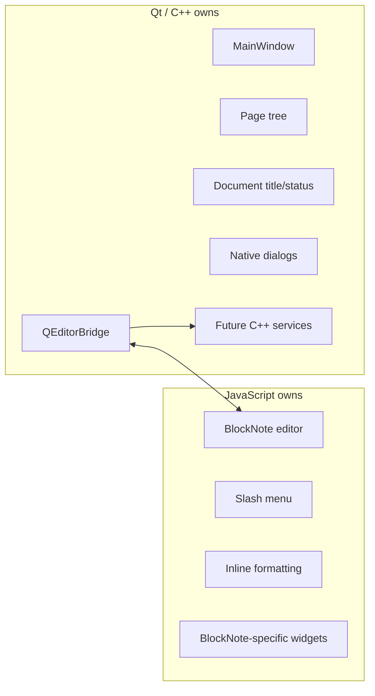
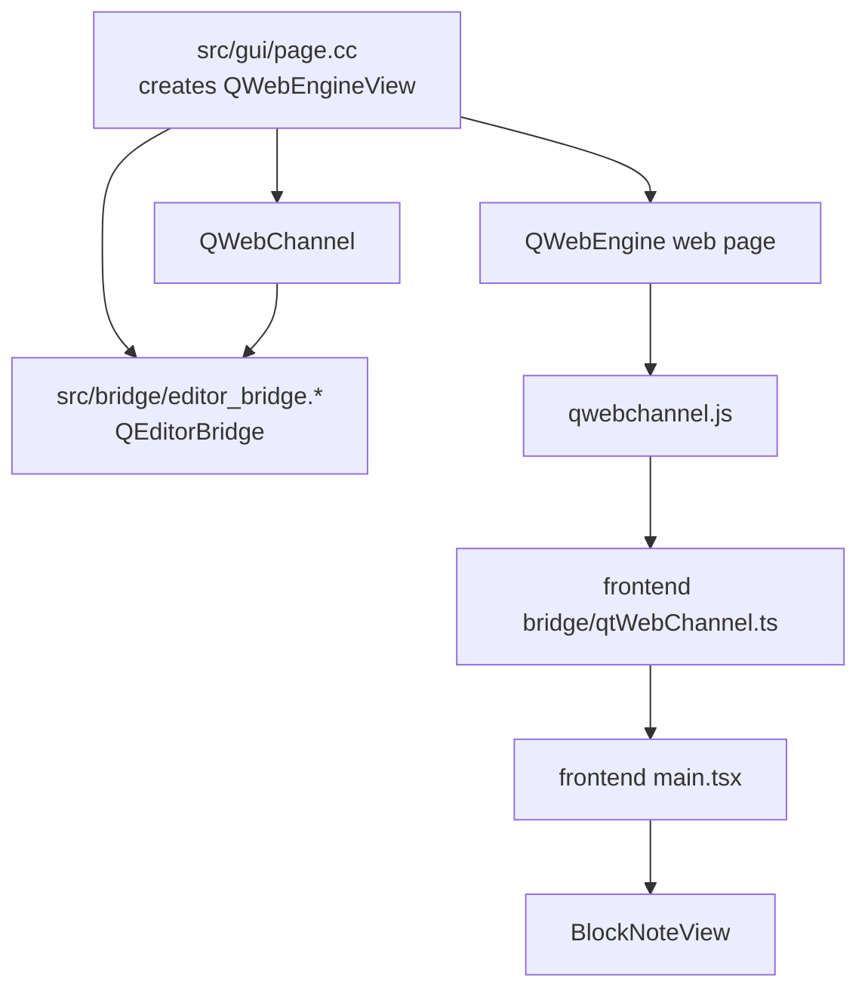
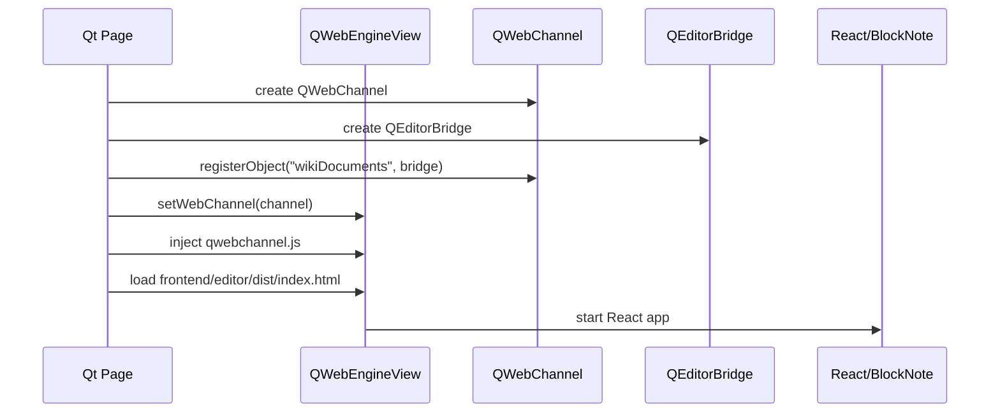
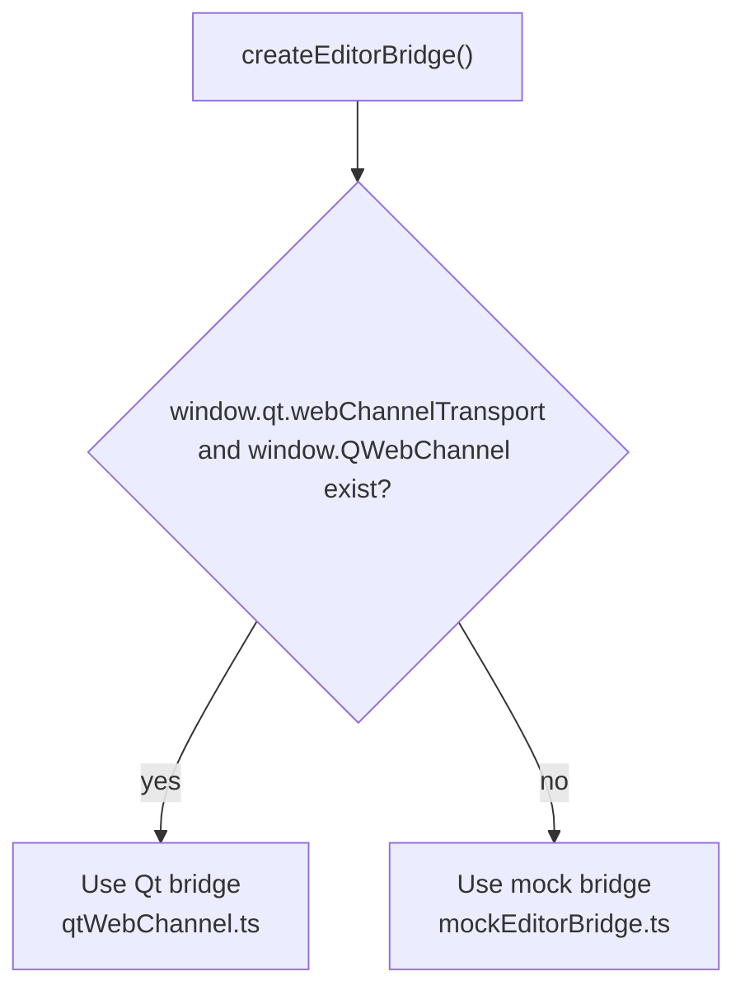
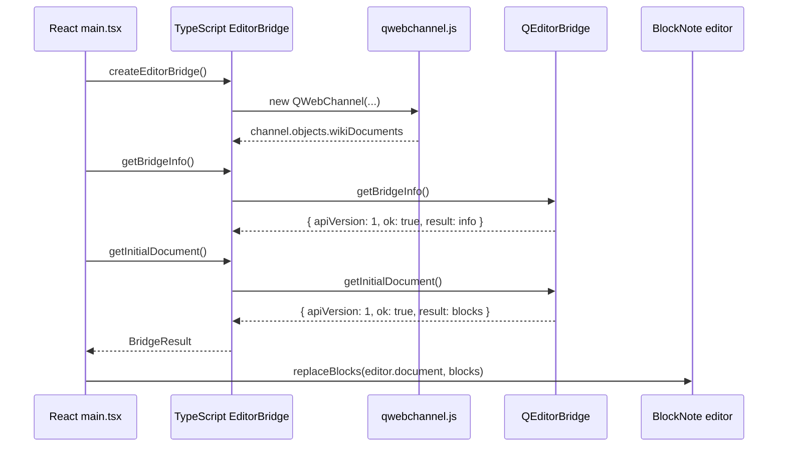
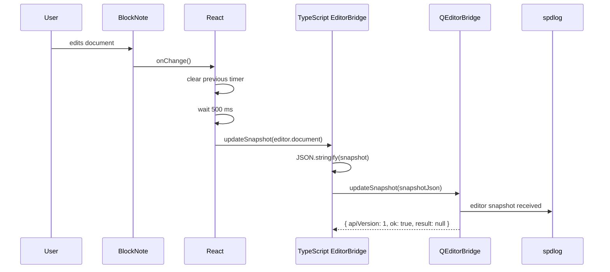
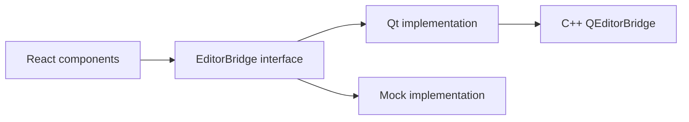
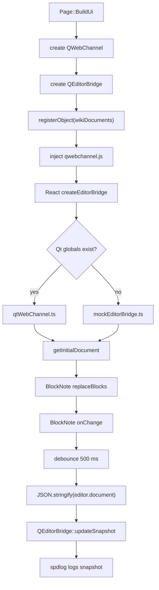
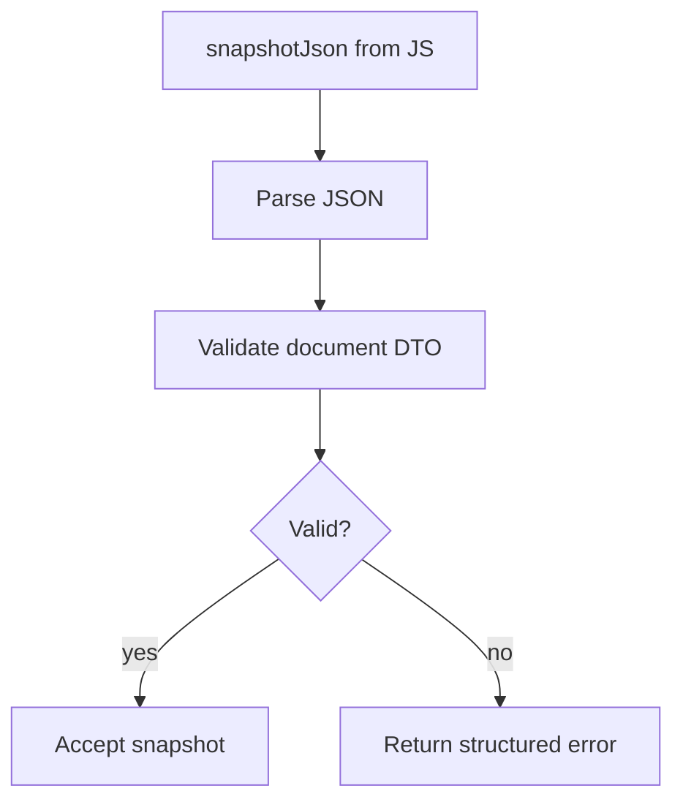

# QWebChannel Editor Bridge Explained

**Product:** CppWiki / Wiki Platform v9 - Block Document Edition  
**Status:** Implementation explanation  
**Date:** 2026-06-14  
**Related code:** `src/bridge/editor_bridge.*`, `src/gui/page.*`, `frontend/editor/src/bridge/*`, `frontend/editor/src/main.tsx`

---

# 1. What Problem This Solves

The editor is a JavaScript app running inside `QWebEngineView`.

The real application is a Qt/C++ desktop app.

So we need a controlled bridge:

```text
JavaScript editor
  <-> Qt WebChannel
  <-> C++ bridge object
  <-> future C++ services
```

For now, the bridge does only two things:

1. JS asks C++ for the initial document.
2. JS sends changed BlockNote snapshots back to C++.

No persistence happens yet. The C++ side only logs received snapshots.

---

# 2. Ownership Boundary

Qt owns the application shell.

JavaScript owns the editor widget.



Important rule:

The JavaScript editor does not get direct access to files, tokens, database, sync, auth or permissions.

It can only call methods explicitly exposed by `QEditorBridge`.

---

# 3. Main Pieces



Code mapping:

| Concept | File |
| :--- | :--- |
| Creates web view and channel | `src/gui/page.cc` |
| C++ object exposed to JS | `src/bridge/editor_bridge.h` / `.cc` |
| TypeScript bridge interface | `frontend/editor/src/bridge/editorBridge.ts` |
| Qt-specific JS adapter | `frontend/editor/src/bridge/qtWebChannel.ts` |
| Browser fallback adapter | `frontend/editor/src/bridge/mockEditorBridge.ts` |
| React integration | `frontend/editor/src/main.tsx` |

---

# 4. Startup Flow

When the app opens the editor page, C++ creates the web view and bridge first.



Relevant C++ code:

```cpp
channel_ = new QWebChannel(this);
editor_bridge_ = new bridge::QEditorBridge(this);
channel_->registerObject(QStringLiteral("wikiDocuments"), editor_bridge_);

editor_view_ = new QWebEngineView(this);
editor_view_->page()->setWebChannel(channel_);
InstallWebChannelScript();
```

The name is important:

```cpp
"wikiDocuments"
```

That is the name JavaScript uses later:

```ts
channel.objects.wikiDocuments
```

---

# 5. How JavaScript Finds Qt

Inside Qt WebEngine, `qwebchannel.js` exposes `QWebChannel`.

Qt also exposes:

```ts
window.qt.webChannelTransport
```

The TypeScript adapter checks whether both exist:

```ts
if (!window.qt?.webChannelTransport || !window.QWebChannel) {
  return null;
}
```

If they exist, the app is running inside Qt.

If they do not exist, the app is probably running in a normal browser through Vite, so it uses the mock bridge.



This is why frontend development can still work with:

```bash
npm run dev
```

without launching the Qt app.

---

# 6. Initial Document Flow

The React app asks the bridge for the initial document.



C++ method:

```cpp
QVariantMap QEditorBridge::getInitialDocument() {
  return SuccessResponse(InitialDocument());
}
```

TypeScript call:

```ts
const response = await created_bridge.getInitialDocument();
if (response.ok && Array.isArray(response.result)) {
  editor.replaceBlocks(editor.document, response.result);
}
```

The response shape is:

```ts
{ apiVersion: 1, ok: true, result: ... }
```

Error responses use:

```ts
{ apiVersion: 1, ok: false, error: { code: "...", message: "..." } }
```

---

# 7. Editor Change Flow

When the user edits the document, BlockNote fires `onChange`.

React waits 500 ms before sending the snapshot. This is called debounce.

Without debounce, every tiny keystroke could send a message to C++.



React code:

```ts
const handleEditorChange = () => {
  if (!bridge) {
    return;
  }

  if (snapshot_timer.current !== null) {
    window.clearTimeout(snapshot_timer.current);
  }

  snapshot_timer.current = window.setTimeout(() => {
    void bridge.updateSnapshot(editor.document);
  }, kSnapshotDebounceMs);
};
```

C++ code:

```cpp
QVariantMap QEditorBridge::updateSnapshot(const QString& snapshot_json) {
  const auto snapshot_bytes = snapshot_json.toUtf8();
  const auto document = QJsonDocument::fromJson(snapshot_bytes);
  const auto block_count = document.isArray() ? document.array().size() : 0;

  spdlog::info(
      "editor snapshot received: bytes={}, blocks={}",
      snapshot_bytes.size(),
      block_count);

  return SuccessResponse(QVariant{});
}
```

For now this only logs. Later this method will call document validation and persistence.

---

# 8. Why There Is a TypeScript Bridge Layer

React could call `window.qt` directly, but that would spread Qt-specific code everywhere.

Instead we use this interface:

```ts
export interface EditorBridge {
  getInitialDocument(): Promise<BridgeResult<DocumentSnapshot>>;
  updateSnapshot(snapshot: DocumentSnapshot): Promise<BridgeResult<void>>;
}
```

React only knows this:

```ts
bridge.updateSnapshot(editor.document);
```

React does not know:

- what `QWebChannel` is;
- what `window.qt.webChannelTransport` is;
- how callbacks are converted;
- whether the app is running in Qt or browser mock mode.



This keeps the frontend simple and testable.

---

# 9. Code Walkthrough By File

This section explains what each file is responsible for.

## 9.1. `src/gui/page.h`

`Page` owns the editor web view and the bridge objects:

```cpp
QWebEngineView* editor_view_ = nullptr;
QWebChannel* channel_ = nullptr;
bridge::QEditorBridge* editor_bridge_ = nullptr;
```

Meaning:

- `editor_view_` displays the React/BlockNote frontend.
- `channel_` is the communication pipe between the web page and C++.
- `editor_bridge_` is the C++ object exposed to JavaScript.

`Page` also declares:

```cpp
void InstallWebChannelScript();
```

This function injects `qwebchannel.js` into the web page.

## 9.2. `src/gui/page.cc`

`BuildUi()` wires the C++ side:

```cpp
channel_ = new QWebChannel(this);
editor_bridge_ = new bridge::QEditorBridge(this);
channel_->registerObject(QStringLiteral("wikiDocuments"), editor_bridge_);
```

This creates the channel, creates the C++ bridge object, and publishes it under the JavaScript name `wikiDocuments`.

Then it creates the web view and connects the channel:

```cpp
editor_view_ = new QWebEngineView(this);
editor_view_->page()->setWebChannel(channel_);
InstallWebChannelScript();
```

After this, the web page can connect to the channel.

`InstallWebChannelScript()` loads Qt's own `qwebchannel.js` resource:

```cpp
QFile script_file(QStringLiteral(":/qtwebchannel/qwebchannel.js"));
```

Then it injects the script at document creation:

```cpp
script.setInjectionPoint(QWebEngineScript::DocumentCreation);
editor_view_->page()->scripts().insert(script);
```

This is why JavaScript can later use:

```ts
window.QWebChannel
window.qt.webChannelTransport
```

## 9.3. `src/bridge/editor_bridge.h`

`QEditorBridge` is the C++ API exposed to JavaScript:

```cpp
class QEditorBridge final : public QObject {
  Q_OBJECT

 public:
  explicit QEditorBridge(QObject* parent = nullptr);

  Q_INVOKABLE QVariantMap getBridgeInfo();
  Q_INVOKABLE QVariantMap getInitialDocument();
  Q_INVOKABLE QVariantMap updateSnapshot(const QString& snapshot_json);
};
```

Important parts:

- `QObject` makes the class visible to Qt's meta-object system.
- `Q_OBJECT` enables Qt introspection.
- `Q_INVOKABLE` makes methods callable through `QWebChannel`.
- `QVariantMap` is easy for Qt to convert into JavaScript objects.
- `QString` is used for incoming JSON because it is predictable across the bridge.

JavaScript sees this as an object with methods:

```ts
wikiDocuments.getBridgeInfo(...)
wikiDocuments.getInitialDocument(...)
wikiDocuments.updateSnapshot(...)
```

## 9.4. `src/bridge/editor_bridge.cc`

`SuccessResponse()` and `ErrorResponse()` build a versioned response envelope:

```cpp
return QVariantMap{
    {QStringLiteral("apiVersion"), 1},
    {QStringLiteral("ok"), true},
    {QStringLiteral("result"), result},
};
```

JavaScript receives:

```ts
{ apiVersion: 1, ok: true, result: ... }
```

Errors use the same envelope:

```ts
{
  apiVersion: 1,
  ok: false,
  error: { code: "...", message: "..." }
}
```

`InitialDocument()` currently returns hardcoded starter blocks. This is temporary. Later it should load a real document from the document service or repository.

`getBridgeInfo()` exposes the bridge API version, namespace and method list. React calls it during startup before loading the initial document.

`getInitialDocument()` returns those blocks:

```cpp
QVariantMap QEditorBridge::getInitialDocument() {
  return SuccessResponse(InitialDocument());
}
```

`updateSnapshot()` receives the editor state as JSON text:

```cpp
QVariantMap QEditorBridge::updateSnapshot(const QString& snapshot_json)
```

It parses the JSON only enough to log basic information:

```cpp
QJsonParseError parse_error;
const auto document = QJsonDocument::fromJson(snapshot_bytes, &parse_error);
```

Invalid JSON and non-array snapshot roots are rejected with structured errors. Valid snapshots are logged:

```cpp
editor snapshot received: bytes=..., blocks=...
```

Later this is where validation and persistence will be called.

## 9.5. `frontend/editor/src/bridge/editorBridge.ts`

This file defines the frontend-facing interface:

```ts
export interface EditorBridge {
  getBridgeInfo(): Promise<BridgeResult<BridgeInfo>>;
  getInitialDocument(): Promise<BridgeResult<DocumentSnapshot>>;
  updateSnapshot(snapshot: DocumentSnapshot): Promise<BridgeResult<void>>;
}
```

React uses this interface and does not care whether the real implementation is Qt or a mock.

The response type is:

```ts
export type BridgeResult<T> =
  | { apiVersion: 1; ok: true; result: T }
  | { apiVersion: 1; ok: false; error: { code: string; message: string } };
```

That matches the response shape C++ returns for successful and failed calls.

## 9.6. `frontend/editor/src/bridge/qtWebChannel.ts`

This file contains all Qt-specific frontend code.

It first declares Qt globals for TypeScript:

```ts
window.qt?.webChannelTransport
window.QWebChannel
```

Then it checks if the app is running inside Qt:

```ts
if (!window.qt?.webChannelTransport || !window.QWebChannel) {
  return null;
}
```

If not, it returns `null`, so the app can use the mock bridge.

If yes, it creates a JavaScript `QWebChannel`:

```ts
new window.QWebChannel!(window.qt!.webChannelTransport!, (channel) => {
  resolve(channel.objects.wikiDocuments as QtEditorBridgeObject);
});
```

This line retrieves the C++ object registered in `page.cc`:

```cpp
channel_->registerObject(QStringLiteral("wikiDocuments"), editor_bridge_);
```

`updateSnapshot()` converts the editor document to JSON:

```ts
qtObject.updateSnapshot(JSON.stringify(snapshot), resolve);
```

This is why C++ receives `QString snapshot_json`.

## 9.7. `frontend/editor/src/bridge/mockEditorBridge.ts`

This file is used when frontend runs outside Qt.

It returns a fake initial document and accepts snapshot updates without doing anything.

This lets frontend development work through Vite:

```bash
npm run dev
```

without launching the C++ desktop app.

## 9.8. `frontend/editor/src/bridge/index.ts`

This file chooses the implementation:

```ts
return (await createQtEditorBridge()) ?? createMockEditorBridge();
```

Meaning:

- use Qt bridge when running inside Qt;
- otherwise use mock bridge.

## 9.9. `frontend/editor/src/main.tsx`

React stores the bridge:

```ts
const [bridge, setBridge] = useState<EditorBridge | null>(null);
```

On startup, it creates the bridge:

```ts
void createEditorBridge().then(async (created_bridge) => {
  setBridge(created_bridge);
```

Then it asks C++ or mock for the initial document:

```ts
const response = await created_bridge.getInitialDocument();
```

If the response is valid, it replaces the current BlockNote content:

```ts
editor.replaceBlocks(editor.document, response.result);
```

When the user edits the document, BlockNote calls:

```tsx
onChange={handleEditorChange}
```

`handleEditorChange()` debounces changes and sends a snapshot:

```ts
snapshot_timer.current = window.setTimeout(() => {
  void bridge.updateSnapshot(editor.document);
}, kSnapshotDebounceMs);
```

The debounce delay is currently:

```ts
const kSnapshotDebounceMs = 500;
```

So snapshots are sent at most after the user stops changing the editor for 500 ms.

## 9.10. End-To-End Code Path



---

# 10. Current Limitations

This is only the first bridge spike.

Current behavior:

- initial document comes from hardcoded C++ data;
- document changes are sent to C++;
- C++ logs snapshot size and block count;
- no validation yet;
- no local persistence yet;
- no error handling beyond the response shape;
- no save status UI yet.

Not implemented yet:

- typed document DTOs;
- schema validation;
- save/load repository;
- Couchbase Lite storage;
- sync;
- auth;
- lock/read-only behavior.

---

# 11. What To Do Next In The Roadmap

## 11.1. Finish QWebChannel Contract

Make the bridge contract explicit:

- define API version;
- define `request_id`;
- define error codes;
- add structured logging;
- add a small bridge smoke test or manual test checklist.

Expected result:

```text
JS can call C++.
C++ can return initial document.
JS can send snapshots to C++.
C++ logs received snapshots.
```

## 11.2. Document Model Skeleton

After the bridge works, add real document types:

- `PageDocument`;
- `Block`;
- `schema_version`;
- stable page IDs;
- stable block IDs;
- basic validation.

Then `updateSnapshot` should do this:



## 11.3. Local Persistence

Only after validation exists:

- add `LocalDocumentRepository`;
- save last valid document;
- load document on startup;
- preserve previous valid version on save failure.

---

# 12. Quick Manual Test

Build frontend:

```bash
cd frontend/editor
npm run build
```

or through CMake:

```bash
cmake --build --preset debug --target editor_bundle
```

Build C++:

```bash
cmake --build --preset debug
```

Run app:

```bash
build/debug/src/cppwiki
```

Edit the document.

Expected log:

```text
editor snapshot received: bytes=..., blocks=...
```

If the frontend is opened through Vite instead of Qt:

```bash
cd frontend/editor
npm run dev
```

Expected behavior:

- app still opens;
- mock initial document appears;
- edits do not go to C++.
